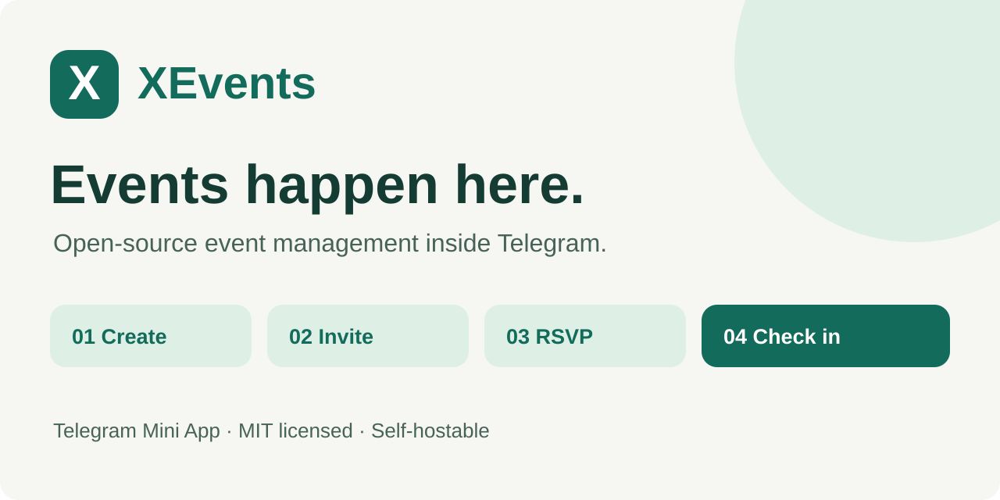
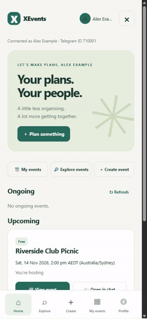
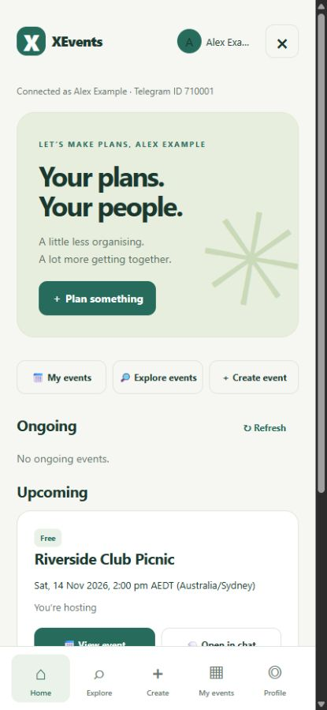
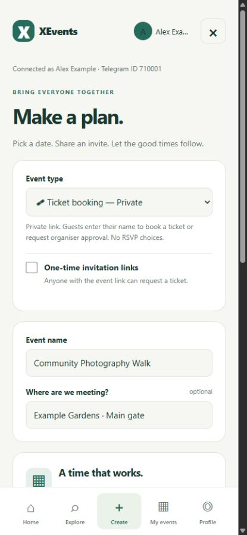
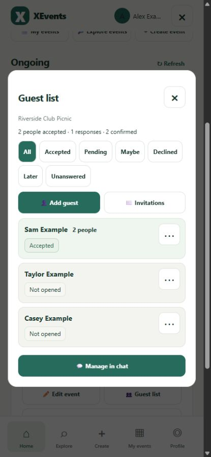
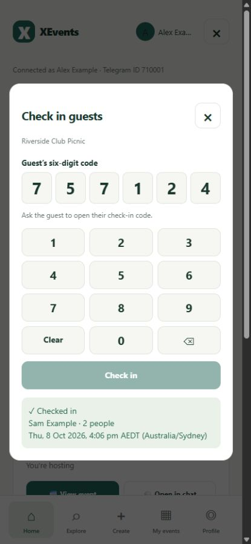

# XEvents

**Open-source event management inside Telegram.**

Create events, invite guests, collect RSVPs, issue tickets, check people in, and share event media without leaving Telegram.

**[Try XEvents on Telegram →](https://t.me/XEvents_bot)** · [Demo walkthrough](#try-the-demo) · [Self-hosting](docs/self-hosting.md) · [Contributing](CONTRIBUTING.md)



[](LICENSE) [](https://t.me/XEvents_bot) [](docs/architecture.md)

For clubs, meetups, workshops and community gatherings. Hosts and guests use Telegram; there is no separate app to install.

## Try the demo

1. Open **[@XEvents_bot](https://t.me/XEvents_bot)** and press **Start**.
2. Use **App** to explore the Mini App, or **Create event** for the guided chat flow.
3. For your own event, choose a shared ticket-booking link or a named guest list with personal RSVP links.
4. Manage replies and guests, then use **Check in guests** on event day.

### A look inside

Real app screens, captured locally with fictional events and mocked Telegram calls:



[Open the animated walkthrough](docs/screenshots/walkthrough.gif) · [Capture details and limitations](docs/demo.md)

<table>
<tr><td></td><td></td></tr>
<tr><td>Home and upcoming plans</td><td>Create an event</td></tr>
<tr><td></td><td></td></tr>
<tr><td>Manage RSVPs and group counts</td><td>Check in guests</td></tr>
</table>

[Download the optional MP4 version](docs/screenshots/walkthrough.mp4)

The walkthrough is a silent sequence of actual local UI captures, not a live Telegram recording. The public bot is a live service. For experiments, use your own development bot and fictional data following the [self-hosting guide](docs/self-hosting.md).

## Features

| For organisers | For guests |
| --- | --- |
| Create events in chat or the Mini App, with timezones and reminders | Open invitations and see local event times |
| Share booking links or personal invitations; manage co-hosts | Accept, Reject, Maybe or Respond later on named invitations |
| Track group counts, approval requests and attendance | Receive tickets after required approval and payment |
| Check in groups with on-demand codes or optional QR tickets | Request a short-lived check-in code; use QR when enabled |
| Configure free events, manual payments or Telegram Stars | Share photos, videos and files in the event gallery |
| Control guest-list, media and private-location access | Access private details when attendance requirements are met |

QR codes are optional and off for new events. Stars payouts to organisers are manual. Direct card processing and calendar synchronisation are not implemented.

[Full feature guide](docs/features.md) · [Invitations and guest counts](docs/invitations.md) · [Payments and refunds](docs/payments.md)

## Run XEvents yourself

You need **Node.js 22+**, npm, your own Telegram bot, and Cloudflare Workers with D1.

```sh
git clone https://github.com/ehsan0921/Telegram-event-management.git
cd Telegram-event-management
npm ci
cp .dev.vars.example .dev.vars
# Fill .dev.vars with your own development bot secrets before continuing.
npx wrangler d1 migrations apply xevents --local
npx wrangler dev
```

Open the local **/app** route to preview the interface. Signed Telegram identity is required for private data; follow [local and Telegram setup](docs/self-hosting.md#run-the-worker-locally) for a complete flow. Keep development and production bots separate.

XEvents is MIT-licensed JavaScript with a plain HTML/CSS Mini App. A Cloudflare Worker serves the webhook, Mini App and API; D1 stores records, and Telegram hosts uploaded media. Provider quotas apply: unlimited free hosting or storage is not promised. [Architecture and limits →](docs/architecture.md)

## Documentation

| Guide | Purpose |
| --- | --- |
| [Detailed overview](docs/overview.md) | Extended introduction, invitation examples and quick start |
| [Self-hosting](docs/self-hosting.md) | Your own bot, database, secrets and deployment |
| [Development](docs/development.md) | Separate environments and required checks |
| [Features](docs/features.md) | Supported flows and examples |
| [Invitations](docs/invitations.md) | RSVP, guest counts, co-hosts and check-in |
| [Payments](docs/payments.md) | Manual review, Stars and refunds |
| [Architecture](docs/architecture.md) | Code map and operational constraints |
| [UX review](docs/UX-review.md) | User journeys and test boundaries |

## Contributing

Bug reports, documentation, accessibility improvements and focused pull requests are welcome. Start with [CONTRIBUTING.md](CONTRIBUTING.md). Run **npm test** for regression coverage and **npm run test:worker** for the Worker bundle and local database checks.

Keep tokens, private deployment settings and real guest data out of issues and screenshots. Report vulnerabilities privately through [SECURITY.md](SECURITY.md).

[MIT licence](LICENSE) · **[Plan your next event with XEvents →](https://t.me/XEvents_bot)**
